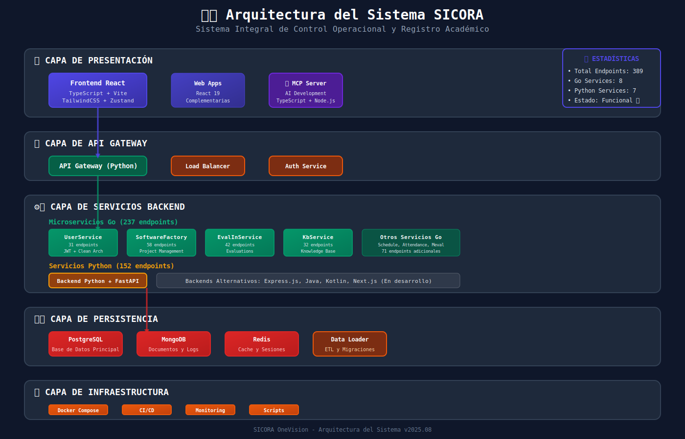

# SICORA - Sistema de Información para Control de Registros Académicos

## 📊 Backend API Statistics

> Last updated: 2025-07-04

- **Total Endpoints**: **389**
- **Go Backend**: 237 endpoints (8 services)
- **Python Backend**: 152 endpoints (7 services + API Gateway)

### Service Distribution:

- **SoftwareFactoryService (Go)**: 58 endpoints
- **EvalInService (Go)**: 42 endpoints
- **KbService (Go)**: 32 endpoints
- **UserService (Go)**: 31 endpoints
- **ScheduleService (Go)**: 28 endpoints
- **AttendanceService (Go)**: 25 endpoints
- **MevalService (Go)**: 18 endpoints
- **API Gateway (Python)**: 49 endpoints
- **EvalInService (Python)**: 28 endpoints
- **UserService (Python)**: 28 endpoints

📋 [Ver conteo completo](./_docs/reportes/CONTEO_ENDPOINTS_BACKEND_SICORA.md)

## 🏗️ Arquitectura del Sistema



_Diagrama de la arquitectura completa del sistema SICORA mostrando las capas de presentación, API Gateway, servicios backend, persistencia e infraestructura._

## 📋 Estructura del Proyecto

```
sicora-app/
├── sicora-app-fe/           # Frontend React + TypeScript + Vite
├── sicora-app-web/          # Aplicación web complementaria
├── sicora-app-web-react19/  # Versión React 19
├── sicora-be-go/            # Backend en Go (microservicios)
├── sicora-be-express/       # Backend en Express.js
├── sicora-be-java/          # Backend en Java
├── sicora-be-kotlin/        # Backend en Kotlin
├── sicora-be-nextjs/        # Backend en Next.js
├── sicora-be-python/        # Backend en Python
├── sicora-mcp-server/       # Servidor MCP para desarrollo asistido por IA
├── sicora-docs/             # Documentación del proyecto
├── sicora-infra/            # Infraestructura y despliegue
└── sicora-shared/           # Recursos compartidos
```

## 🚀 Estado del Proyecto

### ✅ Frontend (React + TypeScript)

- **Framework**: React 18 + TypeScript + Vite
- **UI**: TailwindCSS + Componentes personalizados
- **Estado**: Zustand para gestión de estado
- **Integración**: API REST con backend Go
- **Autenticación**: JWT con refresh automático
- **Estado**: **COMPLETADO Y FUNCIONAL**

### ✅ Backend Go (UserService)

- **Framework**: Gin + Clean Architecture
- **Base de datos**: PostgreSQL
- **Autenticación**: JWT + Refresh tokens
- **API**: REST con documentación Swagger
- **Puerto**: 8002
- **Estado**: **COMPLETADO Y FUNCIONAL**

### 🔄 Integración Frontend-Backend

- **Autenticación**: Completada ✅
- **CRUD Usuarios**: Completado ✅
- **Gestión de sesiones**: Completada ✅
- **Manejo de errores**: Completado ✅
- **Pruebas de integración**: Completadas ✅
- **Estado**: **INTEGRACIÓN COMPLETADA**

### 🤖 Servidor MCP (Model Context Protocol)

- **Herramientas**: Análisis, generación de código, integración, pruebas
- **Tecnología**: TypeScript + Node.js
- **Gestor de paquetes**: pnpm
- **Integración**: VS Code + MCP Protocol
- **Estado**: **COMPLETADO Y FUNCIONAL**

## 🛠️ Tecnologías Utilizadas

### Frontend

- React 18 + TypeScript
- Vite (build tool)
- TailwindCSS (estilos)
- Zustand (estado global)
- React Router (navegación)
- Axios/Fetch (HTTP client)

### Backend Go

- Go 1.21+
- Gin (framework web)
- GORM (ORM)
- PostgreSQL (base de datos)
- JWT (autenticación)
- Docker (containerización)

### DevOps & Tools

- Docker & Docker Compose
- Git (control de versiones)
- Makefile (automatización)
- Swagger/OpenAPI (documentación)
- **pnpm** (gestor de paquetes preferido)

### MCP Server (Desarrollo Asistido por IA)

- TypeScript + Node.js
- Model Context Protocol (MCP)
- VS Code Integration
- Herramientas especializadas para SICORA
- pnpm (gestión de dependencias)

## � Documentación

Para documentación detallada, consulta la [documentación organizada](./_docs/):

- [📋 Integración](./_docs/integracion/) - Integración frontend-backend, verificaciones de conectividad
- [🤖 MCP](./_docs/mcp/) - Servidor MCP, guías para principiantes, configuración
- [⚙️ Configuración](./_docs/configuracion/) - Setup de servicios, variables de entorno
- [🔧 Desarrollo](./_docs/desarrollo/) - Guías de desarrollo, estándares de código
- [📊 Reportes](./_docs/reportes/) - Reportes de estado, análisis, métricas
- [📖 Guías](./_docs/guias/) - Tutoriales, mejores prácticas, casos de uso

### Documentación por Componente

### Frontend

- [Setup Frontend](./sicora-app-fe/README.md)
- [Integración Completada](./sicora-app-fe/INTEGRACION_FRONTEND_BACKEND_COMPLETADA.md)
- [Configuración de Entorno](./sicora-app-fe/.env.development)

### Backend Go

- [UserService Documentation](./sicora-be-go/userservice/README.md)
- [API Documentation](./sicora-be-go/userservice/docs/)
- [Setup Guide](./sicora-be-go/userservice/GO-USERSERVICE-SETUP.md)

### Servidor MCP

- [Guía de uso con pnpm](./_docs/mcp/README-pnpm.md)
- [Configuración completada](./_docs/mcp/CONFIGURACION_MCP_PNPM_COMPLETADA.md)
- [Scripts de desarrollo](./sicora-mcp-server/scripts/)

## 🚀 Inicio Rápido

### 1. Clonar el repositorio

```bash
git clone <repository-url>
cd sicora-app
```

### 2. Iniciar Backend Go

```bash
cd sicora-be-go/userservice
./dev.sh
# Backend estará disponible en http://localhost:8002
```

### 3. Iniciar Frontend

```bash
cd sicora-app-fe
npm install  # o pnpm install
npm run dev  # o pnpm dev
# Frontend estará disponible en http://localhost:5173
```

### 4. Verificar Integración

```bash
cd sicora-app-fe
./scripts/verify-backend-integration.sh
```

## 🧪 Pruebas

### Pruebas de Integración Automatizadas

La aplicación incluye un panel de pruebas integrado que permite verificar:

- Conectividad con el backend
- Registro de usuarios
- Autenticación (login/logout)
- Gestión de tokens JWT
- Actualización de perfil

### Ejecución Manual

1. Abrir la aplicación frontend
2. Navegar al panel de pruebas de integración
3. Ejecutar pruebas individuales o completas
4. Revisar logs y resultados

## 📊 Características Implementadas

### ✅ Sistema de Autenticación

- Login con email/password
- Registro de nuevos usuarios
- JWT tokens con refresh automático
- Logout con limpieza de sesión
- Recuperación de contraseña
- Verificación automática de tokens

### ✅ Gestión de Usuarios

- CRUD completo de usuarios
- Perfiles de usuario
- Roles y permisos (admin, coordinador, instructor, aprendiz)
- Estados de usuario (activo, inactivo, suspendido)
- Operaciones en lote (admin)

### ✅ Seguridad

- Autenticación JWT segura
- Refresh tokens automáticos
- Middleware de autorización
- Validación de datos
- Headers de seguridad

### ✅ UX/UI

- Interfaz moderna y responsiva
- Estados de carga
- Manejo de errores
- Feedback visual
- Sistema de branding adaptable para cualquier institución educativa

## 🔧 Configuración

### Variables de Entorno - Frontend

```env
VITE_API_BASE_URL=http://localhost:8002
VITE_USER_SERVICE_URL=http://localhost:8002
VITE_DEBUG_MODE=true
VITE_CORS_ENABLED=true
```

### Variables de Entorno - Backend

```env
DB_HOST=localhost
DB_PORT=5432
DB_NAME=sicora_users
DB_USER=sicora_user
DB_PASSWORD=sicora_password
JWT_SECRET=your-super-secret-key
PORT=8002
```

## 📈 Próximos Pasos

### Desarrollo Inmediato

- [ ] Integración con otros microservicios
- [ ] Tests E2E automatizados
- [ ] Optimización de rendimiento
- [ ] Mejoras de UX

### Desarrollo a Mediano Plazo

- [ ] Dashboard administrativo
- [ ] Reportes y analytics
- [ ] Notificaciones en tiempo real
- [ ] API mobile

## 🤝 Contribución

### Workflow de Desarrollo

1. Crear rama feature desde main
2. Desarrollar y probar localmente
3. Commit con mensajes descriptivos
4. Pull request con revisión
5. Merge a main después de aprobación

### Standards de Código

- **Frontend**: ESLint + Prettier
- **Backend**: gofmt + golint
- **Commits**: Conventional Commits
- **Documentación**: README actualizado

## 📞 Soporte

### Contacto Técnico

- **Email**: dev@onevision.education
- **Documentación**: ./sicora-docs/
- **Issues**: GitHub Issues

### Recursos

- [Documentación API](http://localhost:8002/swagger/index.html)
- [Panel Admin](http://localhost:5173/admin)
- [Guías de Desarrollo](./sicora-docs/)

---

**SICORA** - Desarrollado con ❤️ por OneVision Open Source
_Sistema de Información para Control de Registros Académicos - Open Source Educational Platform_
