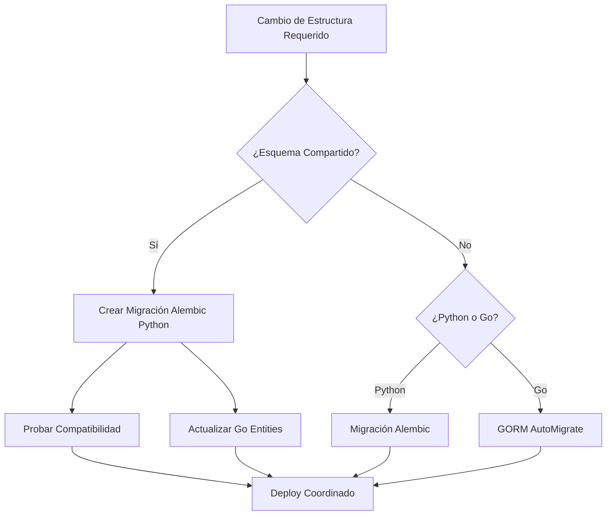

# 🔗 Coordinación Multi-Stack - Base de Datos Compartida SICORA

## 📋 Resumen Ejecutivo

SICORA-APP implementa una **arquitectura multistack híbrida** donde **Python (FastAPI) y Go comparten la misma base de datos PostgreSQL** (`sicora_db`) utilizando **esquemas separados por servicio**. Esta arquitectura permite que ambos stacks coexistan y se complementen mientras mantienen separación de responsabilidades.

## 🏗️ Arquitectura de Base de Datos

### Base de Datos Única Compartida

```
sicora_db (PostgreSQL 15)
├── userservice_schema (🔄 COMPARTIDO - Python + Go)
├── scheduleservice_schema (🔄 COMPARTIDO - Python + Go)
├── attendanceservice_schema (🔄 COMPARTIDO - Python + Go)
├── softwarefactoryservice_schema (🔄 MIXTO - Principalmente Go, migraciones Python)
├── evalinservice_schema (🐍 Python FastAPI)
├── kbservice_schema (🐍 Python FastAPI)
├── aiservice_schema (🐍 Python FastAPI)
├── mevalservice_schema (⚡ Go GORM)
└── projectevalservice_schema (🐍 Python FastAPI)
```

## 🔧 Gestión de Migraciones

### Stack Python (FastAPI + SQLAlchemy + Alembic)

**Servicios gestionados**:

- `userservice_schema`
- `scheduleservice_schema`
- `attendanceservice_schema`
- `evalinservice_schema`
- `kbservice_schema`
- `aiservice_schema`
- `projectevalservice_schema`
- `softwarefactoryservice_schema` (solo migraciones, lógica en Go)

**Herramientas**:

- **Alembic**: Gestión de migraciones SQLAlchemy
- **SQLAlchemy Models**: Definición de modelos
- **Esquemas específicos**: Cada servicio tiene su propio esquema

### Stack Go (GORM + AutoMigrate)

**Servicios gestionados**:

- `userservice_schema` (acceso compartido)
- `scheduleservice_schema` (acceso compartido)
- `attendanceservice_schema` (acceso compartido)
- `softwarefactoryservice_schema` (lógica principal)
- `mevalservice_schema` (completo)

**Herramientas**:

- **GORM AutoMigrate**: Migración automática de estructuras
- **Go Entities**: Definición de estructuras
- **Acceso compartido**: Lee de esquemas gestionados por Python

## 🚦 Reglas de Coordinación

### 1. Esquemas Compartidos

#### `userservice_schema`

- **Propietario**: Python Stack (Alembic)
- **Acceso Go**: Solo lectura y escritura de datos
- **Migración**: Exclusivamente via Alembic Python
- **Coordinación**: Go debe respetar estructura Python

#### `scheduleservice_schema`

- **Propietario**: Python Stack (Alembic)
- **Acceso Go**: Solo lectura y escritura de datos
- **Migración**: Exclusivamente via Alembic Python
- **Coordinación**: Go debe respetar estructura Python

#### `attendanceservice_schema`

- **Propietario**: Python Stack (Alembic)
- **Acceso Go**: Solo lectura y escritura de datos
- **Migración**: Exclusivamente via Alembic Python
- **Coordinación**: Go debe respetar estructura Python

### 2. Esquemas Mixtos

#### `softwarefactoryservice_schema`

- **Estructura**: Definida en Python via Alembic
- **Lógica de Negocio**: Implementada en Go
- **Migración**: Python Alembic (coordinada con Go entities)
- **Datos**: Gestión via Go

### 3. Esquemas Exclusivos

#### Python Only

- `evalinservice_schema`
- `kbservice_schema`
- `aiservice_schema`
- `projectevalservice_schema`

#### Go Only

- `mevalservice_schema`

## 📊 Datos de Prueba - Consideraciones Multi-Stack

### Compatibilidad Crítica

Los datos de prueba deben ser **100% compatibles** con ambos stacks:

1. **Tipos de Datos**: Usar tipos PostgreSQL nativos compatibles con SQLAlchemy y GORM
2. **UUIDs**: Formato estándar para claves primarias
3. **Timestamps**: UTC con zona horaria
4. **ENUMs**: Usar VARCHAR con constraints para compatibilidad
5. **JSON**: Formato PostgreSQL JSONB

### Ejemplo de Inserción Compatible

```sql
-- ✅ Compatible con Python SQLAlchemy + Go GORM
INSERT INTO userservice_schema.users (
    id,
    first_name,
    last_name,
    email,
    document_number,
    document_type,
    role,
    is_active,
    created_at,
    updated_at
) VALUES (
    'a0b1c2d3-e4f5-6789-abcd-ef0123456789'::uuid,
    'Juan Carlos',
    'Pérez González',
    'juan.perez@ejemplo.com',
    '1023456789',
    'CC',
    'INSTRUCTOR',
    true,
    CURRENT_TIMESTAMP,
    CURRENT_TIMESTAMP
);
```

## 🔍 Verificación de Integridad

### Comandos de Verificación

```bash
# Verificar esquemas existentes
psql -h localhost -p 5433 -U sicora_user -d sicora_db -c "
SELECT schema_name
FROM information_schema.schemata
WHERE schema_name LIKE '%service%_schema'
ORDER BY schema_name;"

# Verificar tablas por esquema
psql -h localhost -p 5433 -U sicora_user -d sicora_db -c "
SELECT schemaname, tablename, tableowner
FROM pg_tables
WHERE schemaname LIKE '%service%_schema'
ORDER BY schemaname, tablename;"

# Verificar permisos de usuarios
psql -h localhost -p 5433 -U sicora_user -d sicora_db -c "
SELECT
    r.rolname AS username,
    n.nspname AS schema_name,
    p.privilege_type
FROM information_schema.role_usage_grants p
JOIN pg_roles r ON r.rolname = p.grantee
JOIN pg_namespace n ON n.nspname = p.object_name
WHERE n.nspname LIKE '%service%_schema'
ORDER BY r.rolname, n.nspname;"
```

## 🚨 Alertas y Precauciones

### ⚠️ Crítico: Sincronización de Migraciones

1. **NUNCA ejecutar** `GORM AutoMigrate` en esquemas gestionados por Python
2. **SIEMPRE coordinar** cambios de estructura entre equipos
3. **VALIDAR compatibilidad** antes de deploy
4. **Usar transacciones** para cambios que afecten múltiples esquemas

### 🔧 Flujo de Cambios Estructurales



## 📈 Beneficios de esta Arquitectura

### ✅ Ventajas

1. **Consistencia de Datos**: Base de datos única
2. **Separación de Responsabilidades**: Esquemas específicos
3. **Flexibilidad Tecnológica**: Mejor stack para cada dominio
4. **Escalabilidad**: Servicios independientes
5. **Reutilización**: Modelos compartidos donde tiene sentido

### 🔄 Desafíos

1. **Coordinación**: Requiere comunicación entre equipos
2. **Migración Compleja**: Múltiples herramientas de migración
3. **Testing**: Validar compatibilidad multi-stack
4. **Documentación**: Mantener sincronizada la documentación

## 📚 Referencias y Documentación

- [Datos de Prueba VPS](../data-vps/data-requirements.md)
- [Configuración de Infraestructura](../configuracion/)
- [Reportes de Integración](../reportes/)
- [Documentación del Proyecto](../README.md)

---

**Última actualización**: 2025-01-15 10:30:00
**Responsable**: Equipo de Integración SICORA
**Revisión**: Mensual o ante cambios estructurales críticos

## 🎯 Respuesta Directa a tu Consulta

**Pregunta**: ¿Los datos de prueba deben considerar ambos stacks (Python y Go)?

**Respuesta**: **SÍ, ABSOLUTAMENTE**. Los datos de prueba deben ser 100% compatibles con ambos stacks porque:

1. **Comparten la misma base de datos** (`sicora_db`)
2. **Algunos esquemas son utilizados por ambos** stacks (`userservice_schema`, `scheduleservice_schema`, `attendanceservice_schema`)
3. **La integridad referencial** debe mantenerse para ambas implementaciones
4. **Los tipos de datos** deben ser compatibles con SQLAlchemy (Python) y GORM (Go)

Por lo tanto, **todos los scripts SQL de inserción de datos de prueba** en `data-requirements.md` han sido diseñados para funcionar correctamente con ambos stacks.
