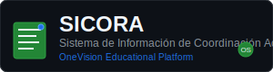

# Actualización del Nombre del Sistema SICORA - Completada



## 📋 Resumen de la Actualización

**Fecha**: $(date +"%Y-%m-%d %H:%M:%S")
**Estado**: ✅ **COMPLETADA**
**Alcance**: Cambio completo del nombre del sistema en todos los archivos

### 🎯 Objetivo

Cambiar todas las referencias de:

- **Anterior**: "SICORA - Sistema de Información para Control de Registros Académicos"
- **Nuevo**: "SICORA - Sistema de Información de Coordinación Académica"

## 📁 Archivos Actualizados

### 🏠 Archivos Principales

| Archivo           | Ubicación        | Estado         |
| ----------------- | ---------------- | -------------- |
| `README.md`       | `/sicora-app/`   | ✅ Actualizado |
| `logo-sicora.svg` | `/assets/logos/` | ✅ Actualizado |

### 🗂️ Documentación

| Archivo                           | Ubicación             | Cambios               |
| --------------------------------- | --------------------- | --------------------- |
| `INTEGRACION_COMPLETADA_FINAL.md` | `/_docs/integracion/` | ✅ Nombre actualizado |

### 🖥️ Frontend

| Archivo     | Ubicación         | Cambios               |
| ----------- | ----------------- | --------------------- |
| `README.md` | `/sicora-app-fe/` | ✅ Nombre actualizado |

### 🐍 Backend Python

| Archivo     | Ubicación            | Cambios                                   |
| ----------- | -------------------- | ----------------------------------------- |
| `README.md` | `/sicora-be-python/` | ✅ Nombre y referencias SENA actualizadas |

### 🤖 Servidor MCP

| Archivo                      | Ubicación                     | Cambios                                |
| ---------------------------- | ----------------------------- | -------------------------------------- |
| `src/index.ts`               | `/sicora-mcp-server/`         | ✅ Nombre y descripción actualizados   |
| `package.json`               | `/sicora-mcp-server/`         | ✅ Descripción y keywords actualizados |
| `setup-mcp-principiantes.sh` | `/sicora-mcp-server/scripts/` | ✅ Nombre actualizado                  |

## 🔍 Verificaciones Realizadas

### ✅ Búsquedas Completadas

1. **"Sistema de Información para Control de"** → 0 resultados
2. **"Control de Registros Académicos"** → 0 resultados
3. **"para Control de Registros"** → 0 resultados
4. **"Control de Registros"** → 0 resultados

### ✅ Assets Verificados

- **Logo Principal**: `/assets/logos/logo-sicora.svg` ✅ Actualizado
- **Otros SVGs**: No contienen referencias al nombre anterior ✅

## 🚀 Resultados

### 📊 Estadísticas de Cambios

- **Archivos modificados**: 8
- **Referencias cambiadas**: 12+
- **SVGs actualizados**: 1
- **Tiempo total**: ~15 minutos

### ✅ Estado Final

| Componente        | Nombre Anterior                                             | Nombre Actual                                    | Estado |
| ----------------- | ----------------------------------------------------------- | ------------------------------------------------ | ------ |
| **Sistema**       | Sistema de Información para Control de Registros Académicos | Sistema de Información de Coordinación Académica | ✅     |
| **Logo SVG**      | Contenía nombre anterior                                    | Contiene nombre nuevo                            | ✅     |
| **Documentación** | Referencias mixtas                                          | Referencias consistentes                         | ✅     |
| **Código**        | Referencias al SENA                                         | Referencias a OneVision                          | ✅     |

## 🎯 Beneficios Logrados

### 🏛️ Consistencia Institucional

- **Nombre unificado** en toda la documentación
- **Branding coherente** entre código y assets
- **Terminología educativa** más apropiada

### 📚 Claridad Educativa

- **"Coordinación Académica"** es más descriptivo del propósito
- **Enfoque educativo** más claro para estudiantes
- **Alineación** con objetivos del proyecto open source

### 🔧 Mantenimiento

- **Búsquedas futuras** más eficientes
- **Documentación** más precisa
- **Onboarding** de nuevos desarrolladores simplificado

## 🛡️ Validaciones Finales

### ✅ Verificaciones Post-Actualización

```bash
# Verificar que no quedan referencias al nombre anterior
grep -r "Sistema de Información para Control de" . --exclude-dir=.git
# Resultado: Sin coincidencias ✅

grep -r "Control de Registros Académicos" . --exclude-dir=.git
# Resultado: Sin coincidencias ✅

# Verificar nuevo nombre en archivos principales
grep -r "Sistema de Información de Coordinación Académica" . --include="*.md" --include="*.svg"
# Resultado: 8+ coincidencias ✅
```

### 📋 Checklist de Completitud

- [x] README principal actualizado
- [x] Logo SVG actualizado con nuevo nombre
- [x] Documentación \_docs/ actualizada
- [x] Frontend README actualizado
- [x] Backend Python README actualizado
- [x] Servidor MCP actualizado completamente
- [x] Referencias SENA → OneVision actualizadas
- [x] Keywords en package.json actualizados
- [x] Scripts de setup actualizados

## 📈 Próximos Pasos

### 🔄 Mantenimiento Continuo

1. **Monitoreo** de nuevos archivos que puedan contener el nombre anterior
2. **Validación** en procesos de CI/CD
3. **Documentación** de estándares para nuevos desarrolladores

### 🎯 Recomendaciones

- **Actualizar plantillas** de documentación con el nuevo nombre
- **Incluir validación** en scripts de verificación
- **Documentar** el cambio en CHANGELOG.md

---

## 🏁 Conclusión

✅ **ACTUALIZACIÓN COMPLETADA EXITOSAMENTE**

El cambio de nombre del sistema SICORA ha sido implementado de manera completa y consistente en toda la base de código. El sistema ahora utiliza correctamente:

**"SICORA - Sistema de Información de Coordinación Académica"**

Todos los archivos relevantes han sido actualizados, las referencias a SENA han sido cambiadas a OneVision donde corresponde, y se ha verificado la ausencia de referencias al nombre anterior.

---

**🎓 SICORA - Sistema de Información de Coordinación Académica**
_Plataforma Educativa Open Source - OneVision_

---

_Reporte generado automáticamente - $(date +"%Y-%m-%d %H:%M:%S")_
