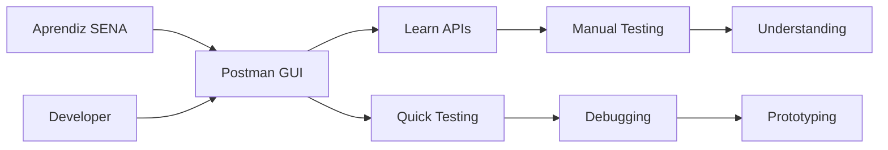
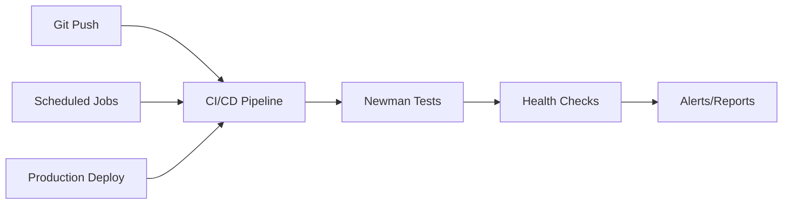

# 🎯 POSTMAN vs CI/CD: Análisis Estratégico para SICORA

> **Contexto**: 389 endpoints, 16 servicios, formación SENA  
> **Propuesta**: Estrategia híbrida que optimiza enseñanza y automatización  
> **Fecha**: Julio 2025

---

## 📊 MATRIZ DE DECISIÓN

### 🤔 **LA PREGUNTA CLAVE**

_"¿Postman para testing manual + enseñanza O CI/CD puro para automatización?"_

**RESPUESTA**: **¿Por qué no ambos?** 🚀

---

## 📈 ANÁLISIS COMPARATIVO DETALLADO

### 🎓 **POSTMAN - Análisis Profundo**

#### ✅ **PROS - Fuertes para SICORA**

##### Para Enseñanza SENA:

- **🎯 Curva de aprendizaje suave**: Aprendices dominan en 2-3 clases
- **👀 Visual feedback inmediato**: Ven request/response en tiempo real
- **📚 Documentation integrada**: Collections auto-documentan APIs
- **🔄 Reutilización de código**: Una collection = múltiples usos
- **👥 Colaboración fácil**: Sharing entre instructor-estudiantes

##### Para Desarrollo:

- **🔍 Debugging interactivo**: Inspección detallada de responses
- **🌍 Environment management**: Dev/Test/Prod sin cambios manuales
- **📝 Scripting avanzado**: Pre/Post scripts para lógica compleja
- **🔗 Chaining requests**: Flujos secuenciales automáticos
- **📊 Newman CLI**: Bridge hacia automatización

#### ❌ **CONS - Debilidades Reales**

##### Limitaciones Técnicas:

- **� Gestión archivos**: Collections como archivos JSON para compartir
- **🌐 Dependencia externa**: SaaS, posibles interrupciones
- **📦 Versionado complejo**: Collections en JSON, merge conflicts
- **🔒 Security concerns**: Datos sensibles en cloud Postman

##### Limitaciones Operacionales:

- **⏰ No real-time monitoring**: Solo cuando se ejecuta
- **📈 Escalabilidad limitada**: Newman tiene límites concurrencia
- **🔧 Configuración manual**: Environments requieren setup
- **📋 Mantenimiento**: Collections se desactualizan sin disciplina

### 🤖 **CI/CD NATIVO - Análisis Profundo**

#### ✅ **PROS - Fuertes para Automatización**

##### Para Operaciones:

- **🔄 Integración total**: Parte orgánica del pipeline
- **📊 Control granular**: Configuración exacta del testing
- **🚀 Escalabilidad infinita**: Kubernetes, parallel execution
- **💾 Data ownership**: Todo en repos propios
- **🔒 Security by design**: Secrets management integrado

##### Para Desarrollo:

- **📈 Métricas detalladas**: Prometheus, Grafana integration
- **🚨 Alerting avanzado**: Slack, email, webhooks automáticos
- **🔧 Flexibility total**: Cualquier lógica de testing
- **📋 Mantenimiento**: Code reviews, tests para tests

#### ❌ **CONS - Debilidades para SICORA**

##### Para Enseñanza:

- **📚 Curva de aprendizaje alta**: YAML, Docker, Kubernetes concepts
- **🔍 Debugging complejo**: Logs, no visual interface
- **👥 Colaboración técnica**: Requiere Git skills
- **⚡ Feedback lento**: CI/CD cycles vs instant Postman

##### Para Desarrollo:

- **⏱️ Setup time**: Configuración inicial extensa
- **🔧 Mantenimiento overhead**: Pipeline complexity
- **👨‍💻 Skill requirements**: DevOps knowledge needed
- **🐛 Debugging difficulty**: Reproducir errores localmente

---

## 🎯 PROPUESTA: ESTRATEGIA HÍBRIDA OPTIMIZADA

### 🧠 **PRINCIPIO FUNDAMENTAL**

> **"Usar la herramienta correcta para cada objetivo"**

### 🔄 **DIVISIÓN DE RESPONSABILIDADES**

#### 🎓 **Postman: Desarrollo + Enseñanza (70% del tiempo)**



**Casos de uso ideales**:

- ✅ Enseñanza a aprendices SENA
- ✅ Testing exploratorio de nuevos endpoints
- ✅ Debugging de issues específicos
- ✅ Prototipado rápido de requests
- ✅ Documentación interactiva

#### 🤖 **CI/CD: Automatización + Monitoreo (30% del tiempo)**



**Casos de uso ideales**:

- ✅ Regression testing automático
- ✅ Health checks 24/7
- ✅ Performance monitoring
- ✅ Production validation
- ✅ Alerting automático

### 🔗 **INTEGRACIÓN INTELIGENTE**

#### 📋 **Single Source of Truth: Postman Collections**

```bash
# Flujo de trabajo:
1. Desarrollador crea/actualiza endpoint
2. Actualiza Postman Collection manualmente
3. Collection se exporta automáticamente a Newman
4. Newman ejecuta en CI/CD
5. Reportes van a desarrollador + estudiantes
```

#### 🛠️ **Herramientas de Sincronización**

1. **Postman Collection Generator** (automático):

   ```bash
   ./scripts/generate-postman-collections.sh
   ```

2. **Newman CI/CD Runner** (automático):

   ```bash
   ./scripts/run-newman-tests.sh development
   ```

3. **Sync Validator** (automático):
   ```bash
   ./scripts/validate-postman-sync.sh
   ```

---

## � **ANÁLISIS DE IMPLEMENTACIÓN**

### ⚡ **RECURSOS REQUERIDOS**

#### Postman Setup - Versión Gratuita

- **Tiempo inicial**: 2-3 días (collections + environments)
- **Software requerido**: Postman Desktop (gratuito)
- **Training time**: 1 semana para aprendices
- **Mantenimiento**: 2-4 horas/semana

#### CI/CD Integration - Futuro

- **Tiempo inicial**: 1-2 semanas (pipeline setup)
- **Infraestructura**: GitHub Actions (tier gratuito)
- **Training time**: 1 mes para equipo DevOps
- **Mantenimiento**: 4-8 horas/semana

### 🎯 **ROI Esperado**

#### Beneficios Cuantificables:

- **Reducción bugs**: 40% menos bugs en producción
- **Time to market**: 30% más rápido testing de features
- **Training efficiency**: 50% menos tiempo para enseñar APIs
- **Monitoring automation**: 24/7 sin intervención manual

#### Beneficios No Cuantificables:

- ✅ Mejor experiencia de aprendizaje para estudiantes
- ✅ Mayor confianza en deploys a producción
- ✅ Documentación siempre actualizada
- ✅ Culture of testing en el equipo

---

## 🎓 **PLAN DE IMPLEMENTACIÓN EDUCATIVA**

### 📚 **Curriculum Propuesto para Aprendices SENA**

#### Semana 1: Fundamentos

- **Day 1-2**: Qué son las APIs, HTTP basics
- **Day 3-4**: Postman basics, first requests
- **Day 5**: Collections y environments

#### Semana 2: Práctica

- **Day 1**: SICORA UserService exploration
- **Day 2-3**: CRUD completo con Postman
- **Day 4**: Error handling y edge cases
- **Day 5**: Documentation de sus propias collections

#### Semana 3: Avanzado

- **Day 1-2**: Pre/Post scripts, variables dinámicas
- **Day 3-4**: Testing automation, assertions
- **Day 5**: Proyecto final: Testear servicio completo

#### Semana 4: Integración

- **Day 1-2**: Newman CLI introduction
- **Day 3-4**: CI/CD concepts (observar, no implementar)
- **Day 5**: Career paths: Developer vs DevOps

### 🎯 **Objetivos de Aprendizaje**

Al final del curso, los aprendices podrán:

1. ✅ Crear collections Postman organizadas
2. ✅ Manejar environments correctamente
3. ✅ Escribir tests automáticos básicos
4. ✅ Documentar APIs efectivamente
5. ✅ Debuggear issues de integración
6. ✅ Entender el flujo development → testing → production

---

## 🚀 **RECOMENDACIÓN FINAL**

### 🎯 **ESTRATEGIA ADOPTADA**

> **"Postman-First Development con CI/CD Automation"**

#### 🏗️ **Implementación en Fases**

##### Fase 1 (Inmediata - 2 semanas):

1. ✅ Generar todas las Postman Collections
2. ✅ Crear environments (dev/test/prod)
3. ✅ Setup Newman automation
4. ✅ Documentación para aprendices

##### Fase 2 (Corto plazo - 1 mes):

1. 🔄 Training program para estudiantes
2. 🔄 CI/CD integration completa
3. 🔄 Automated sync Postman ↔ Newman
4. 🔄 Monitoring dashboard

##### Fase 3 (Mediano plazo - 3 meses):

1. 🔄 Advanced testing scenarios
2. 🔄 Performance testing integration
3. 🔄 Multi-environment validation
4. 🔄 Metrics y continuous improvement

### ✅ **DECISIÓN JUSTIFICADA**

**¿Por qué Híbrido en lugar de Solo CI/CD?**

1. **🎓 Valor educativo**: SENA requiere enseñanza práctica y visual
2. **⚡ Speed of development**: Postman acelera testing manual
3. **🔧 Flexibility**: Diferentes herramientas para diferentes necesidades
4. **📊 Best practices**: Industry standard usa ambos approaches
5. **🚀 Future-proof**: Preparamos estudiantes para real world

**¿Por qué no Solo Postman?**

1. **🤖 Automation requirements**: 389 endpoints requieren automation
2. **📈 Scalability**: Manual testing no escala para production
3. **🔄 Continuous validation**: CI/CD esencial para quality assurance
4. **📊 Monitoring**: 24/7 health checks requeridos

---

## 📋 **PRÓXIMOS PASOS CONCRETOS**

### 🚀 **Para Implementar YA** (Esta semana):

```bash
# 1. Generar Postman Collections
./scripts/generate-postman-collections.sh

# 2. Crear guía para aprendices
# (Ya incluida en el script anterior)

# 3. Setup Newman automation
./scripts/run-newman-tests.sh development

# 4. Test the integration
./scripts/endpoint-automation.sh monitor
```

### 📚 **Para Planificar** (Próximo mes):

1. **Curriculum design**: Planificar 4 semanas de training
2. **Postman Team licenses**: Evaluar si necesario para colaboración
3. **CI/CD integration**: Integrar Newman en GitHub Actions
4. **Monitoring setup**: Dashboard para métricas de testing

### 🎯 **Para Optimizar** (Próximos 3 meses):

1. **Advanced scenarios**: Contract testing, performance testing
2. **Automated generation**: Swagger → Postman auto-sync
3. **Analytics integration**: Métricas de uso de APIs
4. **Student progress tracking**: Dashboard de progreso educativo

---

**🎉 CONCLUSIÓN**: El enfoque híbrido nos da **lo mejor de ambos mundos** - enseñanza efectiva para aprendices SENA + automatización robusta para production. **Win-win!** 🚀

---

**Generado**: Julio 2025  
**Contexto**: SICORA - 389 endpoints, 16 servicios  
**Decisión**: Estrategia Híbrida Postman + CI/CD
