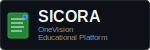

# 🎨 Assets de SICORA

## 📋 Organización de Recursos Visuales

Esta carpeta contiene todos los recursos visuales organizados por categorías para facilitar su uso y mantenimiento.

```
assets/
├── logos/              # Logos oficiales del proyecto
├── diagramas/          # Diagramas técnicos y de errores
├── arquitectura/       # Diagramas de arquitectura del sistema
├── flujos/            # Diagramas de flujo y procesos
├── educativos/        # Recursos educativos y explicativos
└── README.md          # Esta documentación
```

## 🏷️ Logos (`/logos/`)

### `logo-sicora.svg` - Logo Principal

- **Dimensiones**: 400x120px
- **Uso**: README principal, documentación destacada
- **Ruta**: `./assets/logos/logo-sicora.svg`
- **Características**:
  - Tema dark con gradientes azul y verde
  - Incluye icono de integración (círculos conectados)
  - Texto completo "SICORA" con subtítulo
  - Badge "OneVision Open Source"

### `logo-sicora-small.svg` - Logo Compacto

- **Dimensiones**: 200x60px
- **Uso**: Documentación interna, headers de archivos .md
- **Ruta**: `./assets/logos/logo-sicora-small.svg`
- **Características**:
  - Versión compacta del logo principal
  - Mismo esquema de colores
  - Icono simplificado
  - Badge compacto "Academic System"

## 📊 Diagramas (`/diagramas/`)

### `errores-red-docker-sicora.svg` - Errores Docker

- **Dimensiones**: 1200x800px
- **Uso**: Documentación de troubleshooting Docker
- **Ruta**: `./assets/diagramas/errores-red-docker-sicora.svg`
- **Características**:
  - Diagrama de flujo de diagnóstico
  - 4 tipos principales de errores
  - Scripts automáticos disponibles
  - Tema dark consistente

### `resolucion-problemas-docker.svg` - Resolución Problemas Docker

- **Dimensiones**: 1000x750px
- **Uso**: Documentación de resolución de problemas Docker
- **Ruta**: `./assets/diagramas/resolucion-problemas-docker.svg`
- **Características**:
  - Flujo completo de diagnóstico y reparación
  - Herramientas automáticas integradas
  - Casos específicos y soluciones
  - Estrategias de prevención

## 🏗️ Arquitectura (`/arquitectura/`)

### `arquitectura-sistema-sicora.svg` - Arquitectura General

- **Dimensiones**: 1000x700px
- **Uso**: Documentación técnica principal
- **Ruta**: `./assets/arquitectura/arquitectura-sistema-sicora.svg`
- **Características**:
  - Vista completa del sistema
  - Componentes principales
  - Tecnologías utilizadas
  - Conexiones entre servicios

### `microservicios-sicora.svg` - Microservicios Detallados

- **Dimensiones**: 1000x700px
- **Uso**: Documentación de arquitectura de microservicios
- **Ruta**: `./assets/arquitectura/microservicios-sicora.svg`
- **Características**:
  - Servicios Go y Python detallados
  - Puertos y tecnologías específicas
  - Bases de datos y cache
  - Leyenda explicativa

## 🔄 Flujos (`/flujos/`)

### `flujo-desarrollo-git-progresivo.svg` - Git Progresivo

- **Dimensiones**: 800x600px
- **Uso**: Documentación de configuración Git
- **Ruta**: `./assets/flujos/flujo-desarrollo-git-progresivo.svg`
- **Características**:
  - Estrategia de configuración mínima a estricta
  - Beneficios de cada fase
  - Scripts disponibles
  - Enfoque educativo

### `flujo-datos-sicora.svg` - Procesamiento de Datos

- **Dimensiones**: 900x650px
- **Uso**: Documentación de flujo de datos
- **Ruta**: `./assets/flujos/flujo-datos-sicora.svg`
- **Características**:
  - Entrada, validación y procesamiento
  - Servicios específicos por dominio
  - Múltiples bases de datos
  - Salidas y reportes

## 📚 Educativos (`/educativos/`)

### `estructura-documentacion-sicora.svg` - Estructura Docs

- **Dimensiones**: 900x700px
- **Uso**: Guía de organización de documentación
- **Ruta**: `./assets/educativos/estructura-documentacion-sicora.svg`
- **Características**:
  - Estructura de carpetas obligatoria
  - Reglas prohibidas y obligatorias
  - Flujo de trabajo para nueva documentación
  - Ejemplos prácticos

### `conceptos-mcp-sicora.svg` - Conceptos MCP

- **Dimensiones**: 1000x800px
- **Uso**: Educación sobre Model Context Protocol
- **Ruta**: `./assets/educativos/conceptos-mcp-sicora.svg`
- **Características**:
  - Explicación completa de MCP
  - Arquitectura y flujo de comunicación
  - Implementación específica en SICORA
  - Casos de uso prácticos

### `resumen-general-sicora.svg` - Resumen General del Proyecto

- **Dimensiones**: 1200x800px
- **Uso**: Vista general completa del proyecto SICORA
- **Ruta**: `./assets/educativos/resumen-general-sicora.svg`
- **Características**:
  - Stack tecnológico completo
  - Estadísticas del proyecto
  - Enfoque educativo y open source
  - Componentes principales del sistema

### `actualizacion-nombre-sistema-sicora.svg` - Actualización de Nomenclatura

- **Dimensiones**: 800x600px
- **Uso**: Resumen visual del cambio de nomenclatura del sistema
- **Ruta**: `./assets/educativos/actualizacion-nombre-sistema-sicora.svg`
- **Características**:
  - Comparativa de la antigua y nueva nomenclatura
  - Ejemplos prácticos de cada categoría
  - Enfoque educativo para facilitar la transición
  - Diseño coherente con el resto de los assets educativos

## 🎨 Guía de Estilo Visual

### Colores Principales

- **Azul Primario**: #4299e1 → #2b6cb0 (gradiente)
- **Verde Acento**: #38a169 → #2f855a (gradiente)
- **Fondo Dark**: #1a202c
- **Texto Claro**: #ffffff → #e2e8f0 (gradiente)
- **Texto Secundario**: #a0aec0

### Tipografía

- **Fuente**: Monospace (para mantener consistencia técnica)
- **Peso**: Bold para títulos, normal para texto
- **Tamaños**: Escalados según uso (32px principal, 18px compacto)

### Elementos Visuales

- **Gradientes**: Sin degradados planos, siempre con transición
- **Bordes**: Redondeados (rx="8" para logos, rx="12" para diagramas)
- **Sombras**: Sutiles con opacidad 0.3
- **Filtros**: Glow para elementos destacados

## 📐 Uso de Assets

### En README Principal

```markdown

```

### En Documentación Interna (desde \_docs)

```markdown

```

### En Subcarpetas de Documentación

```markdown

```

### Diagramas

```markdown


```

## 🔧 Creación de Nuevos Assets

### Requisitos para Nuevos SVGs

1. **Tema dark obligatorio** (fondo #1a202c)
2. **Sin degradados planos** (usar gradientes lineales)
3. **Esquema de colores consistente**
4. **Tipografía monospace**
5. **Elementos redondeados**
6. **Optimizados para visualización en GitHub**

### Nomenclatura por Categoría

#### Logos

- `logo-sicora-[variante].svg`
- Ejemplos: `logo-sicora-icon.svg`, `logo-sicora-text.svg`

#### Diagramas

- `[tipo]-[descripcion]-sicora.svg`
- Ejemplos: `errores-red-docker-sicora.svg`, `troubleshooting-auth-sicora.svg`

#### Arquitectura

- `arquitectura-[componente].svg`
- Ejemplos: `arquitectura-sistema.svg`, `arquitectura-microservicios.svg`

#### Flujos

- `flujo-[proceso].svg`
- Ejemplos: `flujo-autenticacion.svg`, `flujo-registro.svg`

#### Educativos

- `[concepto]-explicacion.svg`
- Ejemplos: `git-conceptos.svg`, `docker-contenedores.svg`

### Dimensiones Recomendadas

- **Logos principales**: 400x120px
- **Logos compactos**: 200x60px
- **Diagramas**: 1200x800px
- **Arquitectura**: 1000x700px
- **Flujos**: 800x600px
- **Educativos**: 600x400px
- **Iconos**: 64x64px

## 📝 Mantenimiento

### Actualización de Assets

- Mantener versión en esquina inferior (formato: v2025.MM)
- Actualizar fecha cuando se modifique contenido
- Conservar esquema de colores existente
- Actualizar referencias en documentación

### Testing Visual

- Verificar visualización en GitHub (modo dark/light)
- Probar en diferentes tamaños de pantalla
- Validar legibilidad de texto
- Comprobar enlaces en documentación

### Migración de Referencias

Cuando se reorganice la estructura, actualizar todas las referencias:

```bash
# Buscar referencias a assets antiguos
grep -r "assets/" --include="*.md" .

# Patrones comunes a actualizar:
# ./assets/logo-sicora.svg → ./assets/logos/logo-sicora.svg
# ../assets/logo-sicora-small.svg → ../assets/logos/logo-sicora-small.svg
```

---

**Última actualización**: Agosto 2025
**Mantenido por**: Equipo SICORA OneVision
**Estructura**: Categorizada v2.0
