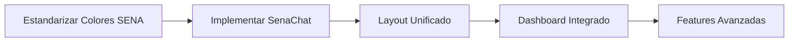

# 📊 ANÁLISIS DE ESTADO Y PLAN DE TRABAJO - FRONTEND SICORA

**Fecha:** 30 de junio de 2025  
**Autor:** Sistema de Análisis SICORA  
**Versión:** 1.0  
**Estado:** Análisis Completo - Listo para Implementación

---

## 📋 **RESUMEN EJECUTIVO**

Este documento presenta un análisis exhaustivo del estado actual del frontend SICORA y propone un plan de trabajo estratégico para implementar una interfaz de usuario robusta que aproveche los avances significativos en el backend (especialmente Go stack y FastAPI para AIService).

### **Contexto del Proyecto**

- **373 archivos** TypeScript/React implementados
- **Backend Go (UserService):** 90% completado con Clean Architecture
- **Backend Python (AI/KB Services):** 100% funcional con chat inteligente
- **Design System:** Atomic Design híbrido parcialmente implementado
- **Identidad SENA:** Configurada pero no aplicada consistentemente

---

## 🏗️ **ESTADO ACTUAL DE LA INFRAESTRUCTURA**

### **✅ FORTALEZAS IDENTIFICADAS**

#### **Arquitectura Técnica Sólida**

- **React 18 + TypeScript + Vite:** Configuración profesional con hot reload
- **Mobile-First Design:** TailwindCSS configurado con breakpoints responsive
- **PWA Ready:** Service worker y manifest configurados
- **Testing Suite:** Jest, Vitest, Cypress configurados
- **CI/CD:** GitHub Actions con automated commits

#### **Design System Parcial**

```
Atomic Design Híbrido Implementado:
├── atoms/ (6/8 componentes) - Button, Input, Badge, LoadingSpinner
├── molecules/ (6/8 componentes) - UserCard, LoginForm, SearchInput
├── organisms/ (6/8 componentes) - UserList, AttendanceList, Navigation
└── templates/ (4/6 layouts) - AdaptiveLayout, AuthLayout
```

#### **Cumplimiento SENA Configurado**

- **Colores oficiales:** Variables CSS con paleta 2024 (#39A900 verde principal)
- **Tipografías:** Work Sans (principal) y Calibri (secundaria)
- **Responsive:** Safe areas y touch targets de 44px mínimo

#### **Módulos Funcionales**

- **UserService:** 90% completado con CRUD, autenticación JWT, bulk operations
- **AttendanceService:** 70% implementado con páginas básicas
- **EvalProy:** 60% con estructura por roles (Instructor, Aprendiz, Admin, Stakeholder)

### **⚠️ ÁREAS DE MEJORA CRÍTICAS**

#### **Inconsistencia en Design Tokens**

```typescript
// PROBLEMA ACTUAL: Button.tsx usa colores genéricos
primary: 'bg-blue-600 text-white hover:bg-blue-700';

// SOLUCIÓN REQUERIDA: Usar paleta SENA
primary: 'bg-sena-verde text-white hover:bg-sena-verde-oscuro';
```

#### **Componentes UI Base Incompletos**

- Falta sistema unificado de modales
- Loading states inconsistentes entre módulos
- Error handling fragmentado
- Navegación sin identidad SENA

#### **Backend Desaprovechado**

- **AIService/KBService:** Chat inteligente SIN interfaz de usuario
- **Go Services:** APIs robustas con UI básica
- **Integración:** Datos disponibles pero no visualizados efectivamente

---

## 🎨 **EVALUACIÓN DE IDENTIDAD VISUAL SENA**

### **✅ ELEMENTOS CONFIGURADOS**

#### **Manual de Identidad 2024 - Implementación Parcial**

```css
/* Variables CSS Oficiales Configuradas */
:root {
  --sena-verde-principal: #39a900; /* Color primario obligatorio */
  --sena-verde-oscuro: #2d7a00; /* Hover states */
  --sena-verde-claro: #4bc209; /* Highlights */
  --sena-violeta: #6b46c1; /* Secundario */
  --sena-azul-claro: #3b82f6; /* Información */
  --sena-azul-oscuro: #1e3a8a; /* Navegación */
  --sena-amarillo: #fbbf24; /* Alertas */
}
```

#### **Tipografía Institucional**

- **Work Sans:** Títulos, botones, elementos importantes
- **Calibri:** Texto corrido, descripciones, contenido general

### **❌ ELEMENTOS FALTANTES**

#### **Logo y Marca Institucional**

- LogoSENA component existe pero no integrado
- Falta aplicación en headers y footers
- Sin validación de uso correcto según manual

#### **Iconografía y Recursos Visuales**

- Sistema de iconos no estandarizado
- Texturas y patrones del manual no implementados
- Fotografía institucional no integrada

#### **Validación de Cumplimiento**

- Sin sistema automático de verificación
- Componentes pueden usar colores no autorizados
- Falta documentación de uso correcto

---

## 📱 **ESTADO POR MÓDULO DE BACKEND**

### **🟢 UserService (Go Stack) - 90% Frontend**

#### **Características Completadas**

- **Autenticación completa:** Login, JWT, refresh tokens
- **CRUD usuarios:** Crear, editar, eliminar, roles
- **Bulk operations:** Carga masiva CSV, gestión de roles
- **Páginas especializadas:** Perfil, estadísticas, auditoría
- **Security:** Rate limiting, validation, error handling

#### **Calidad de Implementación**

- **Mobile-responsive:** Adaptado a touch interfaces
- **Error handling:** Estados de error y recuperación
- **Loading states:** Spinners y feedback visual
- **Atomic Design:** Componentes reutilizables

### **🟡 AttendanceService - 70% Frontend**

#### **Páginas Implementadas**

- `InstructorAttendancePage` - Toma de asistencia mobile-optimized
- `StudentAttendancePage` - Vista de estudiante
- `AdminAttendancePage` - Panel administrativo
- `AttendanceHistoryPage` - Historial y reportes

#### **Necesidades de Mejora**

- **UI Enhancement:** Aplicar design system SENA
- **Calendar Integration:** Vista calendario institucional
- **Offline Support:** Funcionalidad sin conexión para instructores
- **Reporting:** Gráficos con identidad corporativa

### **🟡 EvalProy Service - 60% Frontend**

#### **Estructura por Roles Implementada**

```typescript
// Layouts específicos por actor
├── AprendizLayout.tsx    - Dashboard estudiante
├── InstructorLayout.tsx  - Panel instructor
├── AdminLayout.tsx       - Administración
└── StakeholderLayout.tsx - Vista stakeholders
```

#### **Funcionalidades Parciales**

- **Evaluación de ideas:** Formularios básicos
- **Programación de sesiones:** UI preliminar
- **Calificación de avances:** Estructura preparada
- **Control de alcance:** Componentes base

#### **Desarrollo Requerido**

- **Dashboards específicos:** Métricas por rol
- **Formularios avanzados:** Validación y UX
- **Visualización de datos:** Gráficos y reportes
- **Workflow visual:** Estados de proyecto

### **🔴 AIService/KBService (Python) - 0% Frontend**

#### **Backend Completamente Funcional**

```bash
# Servicios operativos
KBService (Puerto 8006): Base de conocimiento RAG
AIService (Puerto 8007): Chat inteligente con LLM
```

#### **Capacidades Disponibles**

- **Chat inteligente:** Respuestas basadas en reglamento SENA
- **RAG Implementation:** Búsqueda en documentos oficiales
- **API REST:** Endpoints documentados y probados
- **Integración lista:** Comunicación entre servicios

#### **Oportunidad Crítica**

- **Sin interfaz:** Funcionalidad robusta sin UI
- **Alto impacto:** Chat SENA podría ser feature diferenciador
- **Fácil implementación:** APIs bien documentadas

---

## 🎯 **PLAN DE TRABAJO ESTRATÉGICO**

### **FASE 1: CONSOLIDACIÓN DEL DESIGN SYSTEM (Semanas 1-2)**

#### **Objetivo:** Estandarizar identidad SENA en todos los componentes

#### **1.1 Sistema de Design Tokens SENA**

```typescript
// src/design-tokens/sena.ts
export const senaTokens = {
  colors: {
    primary: {
      50: '#f0f9e8',
      500: '#39a900', // Verde principal SENA
      600: '#2d7a00', // Verde oscuro
      700: '#1e5200', // Verde muy oscuro
    },
    secondary: {
      500: '#6b46c1', // Violeta SENA
      600: '#553c9a',
    },
    neutral: {
      50: '#f8fafc', // Gris claro
      900: '#1e1e1e', // Negro SENA
    },
  },
  typography: {
    fontFamily: {
      primary: ['Work Sans', 'system-ui', 'sans-serif'],
      secondary: ['Calibri', 'system-ui', 'sans-serif'],
    },
    fontSize: {
      xs: '0.75rem', // 12px
      sm: '0.875rem', // 14px
      base: '1rem', // 16px
      lg: '1.125rem', // 18px
      xl: '1.25rem', // 20px
    },
  },
  spacing: {
    touch: '44px', // Mínimo para touch targets
    safe: {
      top: 'env(safe-area-inset-top)',
      bottom: 'env(safe-area-inset-bottom)',
    },
  },
};
```

#### **1.2 Refactorización de Componentes Base**

**Prioridad Alta:**

```typescript
// src/components/atoms/TouchButton/TouchButton.tsx
interface TouchButtonProps {
  variant: 'primary' | 'secondary' | 'outline' | 'ghost';
  size: 'sm' | 'md' | 'lg';
  loading?: boolean;
  disabled?: boolean;
  children: React.ReactNode;
}

// CUMPLIMIENTO SENA 2024:
// ✅ Verde institucional #39A900 para variant="primary"
// ✅ Tipografía Work Sans según manual
// ✅ Contraste mínimo 4.5:1 para accesibilidad
// ✅ Touch target 44px mínimo
```

**Componentes a Crear/Actualizar:**

- `TouchButton` - Botón optimizado mobile con colores SENA
- `SenaInput` - Input fields con validation y estilo institucional
- `StatusBadge` - Badges con paleta oficial
- `SenaCard` - Contenedores con sombras y bordes SENA
- `LoadingSpinner` - Indicadores con verde institucional

#### **1.3 Layout Institucional**

```typescript
// src/components/templates/SenaLayout/SenaLayout.tsx
interface SenaLayoutProps {
  children: React.ReactNode;
  title: string;
  user?: User;
  showNavigation?: boolean;
  showHeader?: boolean;
  breadcrumbs?: Array<{ label: string; path?: string }>;
}
```

**Componentes de Layout:**

- `SenaHeader` - Header oficial con logo y navegación
- `SenaFooter` - Footer con información institucional
- `SenaNavigation` - Navegación responsive con drawer mobile
- `SenaBreadcrumbs` - Navegación contextual

### **FASE 2: INTERFAZ PARA AISERVICE/KBSERVICE (Semanas 3-4)**

#### **Objetivo:** Crear chat inteligente SENA aprovechando backend funcional

#### **2.1 Chat Inteligente Institucional**

```typescript
// src/components/organisms/SenaChat/SenaChat.tsx
interface SenaChatProps {
  onMessage: (message: string) => Promise<string>;
  placeholder?: string;
  avatar?: string;
  initialMessages?: ChatMessage[];
  showSuggestions?: boolean;
  maxHeight?: string;
}

interface ChatMessage {
  id: string;
  content: string;
  sender: 'user' | 'assistant';
  timestamp: Date;
  status: 'sending' | 'sent' | 'error';
}
```

**Funcionalidades Clave:**

- **Bubble Interface:** Diseño moderno con colores SENA
- **Typing Indicators:** Feedback visual durante respuesta
- **Message History:** Persistencia de conversaciones
- **Quick Suggestions:** Preguntas frecuentes predefinidas
- **Error Handling:** Recuperación elegante de fallos
- **Offline Mode:** Respuestas básicas sin conexión

#### **2.2 Panel de Base de Conocimiento**

```typescript
// src/components/organisms/KnowledgeBase/KnowledgeBase.tsx
interface KnowledgeBaseProps {
  searchQuery?: string;
  onSearch: (query: string) => Promise<SearchResult[]>;
  onDocumentSelect: (documentId: string) => void;
  categories?: Category[];
}
```

**Características:**

- **Explorador de documentos:** Navegación por categorías
- **Búsqueda avanzada:** Filtros por tipo, fecha, relevancia
- **Vista previa:** Preview de documentos sin salir del chat
- **Historial:** Consultas recientes y marcadores
- **Mobile-optimized:** Touch-friendly para tablets

#### **2.3 Integración API**

```typescript
// src/services/aiService.ts
export class AIService {
  async sendMessage(message: string): Promise<ChatResponse> {
    return this.apiClient.post('/api/v1/chat', { message });
  }

  async searchKnowledge(query: string): Promise<SearchResult[]> {
    return this.apiClient.post('/api/v1/search', { query });
  }
}
```

### **FASE 3: MEJORA VISUAL DE MÓDULOS EXISTENTES (Semanas 5-6)**

#### **Objetivo:** Aplicar identidad SENA a módulos funcionales

#### **3.1 AttendanceService UI Enhancement**

**Rediseño con Identidad SENA:**

- **Calendar View:** Vista calendario con colores institucionales
- **Mobile Forms:** Formularios optimizados para instructores en campo
- **Status Indicators:** Estados de asistencia con iconografía SENA
- **Reports Dashboard:** Gráficos con paleta corporativa

```typescript
// src/components/organisms/AttendanceCalendar/AttendanceCalendar.tsx
interface AttendanceCalendarProps {
  attendances: Attendance[];
  onDateSelect: (date: Date) => void;
  viewMode: 'month' | 'week' | 'day';
  readonly?: boolean;
}
```

#### **3.2 EvalProy Service UI Enhancement**

**Dashboard por Roles:**

- **Instructor Dashboard:** Métricas de proyectos con widgets SENA
- **Student Dashboard:** Progreso personal con gamificación
- **Admin Dashboard:** Overview institucional con KPIs
- **Stakeholder View:** Reportes ejecutivos branded

```typescript
// src/components/organisms/EvalProyDashboard/EvalProyDashboard.tsx
interface EvalProyDashboardProps {
  role: 'instructor' | 'student' | 'admin' | 'stakeholder';
  data: DashboardData;
  widgets: DashboardWidget[];
}
```

#### **3.3 UserService Polish**

**Mejoras Visuales:**

- **Profile Cards:** Diseño con foto y información institucional
- **User Tables:** Tablas responsive con acciones bulk
- **Statistics:** Gráficos de usuarios con branding SENA
- **Bulk Upload:** Interface drag-and-drop mejorada

### **FASE 4: FEATURES AVANZADAS (Semanas 7-8)**

#### **Objetivo:** Funcionalidades que distingan SICORA

#### **4.1 Dashboard Unificado**

```typescript
// src/components/pages/DashboardPage/DashboardPage.tsx
const widgets = [
  {
    id: 'sena-chat',
    component: SenaChat,
    title: 'Asistente SENA',
    size: 'large',
    priority: 'high',
  },
  {
    id: 'attendance-summary',
    component: AttendanceSummary,
    title: 'Resumen de Asistencia',
    size: 'medium',
    priority: 'medium',
  },
  {
    id: 'evaluation-status',
    component: EvaluationStatus,
    title: 'Estado de Evaluaciones',
    size: 'medium',
    priority: 'medium',
  },
  {
    id: 'user-stats',
    component: UserStats,
    title: 'Estadísticas de Usuarios',
    size: 'small',
    priority: 'low',
  },
];
```

**Características del Dashboard:**

- **Responsive Grid:** Layout adaptivo según dispositivo
- **Widget System:** Componentes modulares intercambiables
- **Personalization:** Usuario puede organizar widgets
- **Real-time Updates:** Datos actualizados automáticamente

#### **4.2 PWA Features**

**Capacidades Mobile:**

- **Push Notifications:** Alertas de evaluaciones, asistencia
- **Offline Mode:** Funcionalidad básica sin conexión
- **App Installation:** Instalable en dispositivos móviles
- **Background Sync:** Sincronización automática al recuperar conexión

```typescript
// src/services/pwaService.ts
export class PWAService {
  async registerServiceWorker(): Promise<void>;
  async requestNotificationPermission(): Promise<boolean>;
  async showNotification(
    title: string,
    options: NotificationOptions
  ): Promise<void>;
  async syncInBackground(): Promise<void>;
}
```

#### **4.3 Accessibility & Performance**

**Cumplimiento WCAG 2.1 AA:**

- **Screen Reader Support:** ARIA labels y landmarks
- **Keyboard Navigation:** Navegación completa por teclado
- **High Contrast:** Modo alto contraste
- **Font Scaling:** Soporte para zoom de texto

**Optimización de Performance:**

- **Bundle Analysis:** Análisis y optimización de tamaño
- **Lazy Loading:** Carga diferida de módulos
- **Image Optimization:** Compresión y formatos modernos
- **Service Worker:** Cache inteligente de recursos

### **FASE 5: TESTING & DOCUMENTATION (Semanas 9-10)**

#### **Objetivo:** Calidad y mantenibilidad a largo plazo

#### **5.1 Testing Suite Completo**

```typescript
// src/components/atoms/TouchButton/TouchButton.test.tsx
describe('TouchButton', () => {
  describe('SENA Compliance', () => {
    it('should use official SENA green for primary variant', () => {
      render(<TouchButton variant="primary">Test</TouchButton>);
      expect(screen.getByRole('button')).toHaveClass('bg-sena-verde');
    });

    it('should meet touch target minimum size', () => {
      render(<TouchButton>Test</TouchButton>);
      const button = screen.getByRole('button');
      expect(button).toHaveStyle('min-height: 44px');
    });
  });
});
```

**Testing Strategy:**

- **Unit Tests:** Componentes individuales con Jest
- **Integration Tests:** Flujos completos con React Testing Library
- **E2E Tests:** Scenarios de usuario con Cypress
- **Visual Regression:** Comparación de screenshots con Percy
- **Accessibility Tests:** Auditorías automáticas con axe-core

#### **5.2 Storybook Documentation**

```typescript
// src/components/atoms/TouchButton/TouchButton.stories.tsx
export default {
  title: 'Atoms/TouchButton',
  component: TouchButton,
  parameters: {
    docs: {
      description: {
        component: `
          TouchButton - Botón optimizado para mobile con identidad SENA
          
          **CUMPLIMIENTO SENA 2024:**
          - ✅ Verde institucional #39A900 para variant="primary"
          - ✅ Tipografía Work Sans según manual
          - ✅ Contraste mínimo 4.5:1 para accesibilidad
          - ✅ Touch target 44px mínimo
        `,
      },
    },
  },
};
```

**Documentación Completa:**

- **Component Library:** Todos los componentes documentados
- **Design Guidelines:** Guías de uso de identidad SENA
- **Interactive Examples:** Playground para probar variantes
- **Code Examples:** Snippets de implementación
- **Accessibility Notes:** Consideraciones de accesibilidad

---

## 📋 **PRIORIDADES DE IMPLEMENTACIÓN**

### **🔥 CRÍTICO (Esta Semana)**

#### **1. Estandarización de Colores SENA**

```bash
Tiempo estimado: 2-3 días
Impacto: Alto - Cumplimiento institucional
Riesgo: Bajo - Refactoring directo
```

**Tareas:**

- [ ] Actualizar `Button.tsx` para usar `bg-sena-verde`
- [ ] Revisar todos los componentes con colores hardcodeados
- [ ] Implementar design tokens centralizados
- [ ] Validar contraste según WCAG

#### **2. Implementación de SenaChat**

```bash
Tiempo estimado: 4-5 días
Impacto: Muy Alto - Feature diferenciador
Riesgo: Medio - Integración con backend
```

**Tareas:**

- [ ] Crear componente `SenaChat` base
- [ ] Integrar con AIService API (puerto 8007)
- [ ] Implementar UI de mensajes con identidad SENA
- [ ] Añadir manejo de errores y estados de carga

#### **3. Layout Unificado con Navegación**

```bash
Tiempo estimado: 3-4 días
Impacto: Alto - Coherencia de UX
Riesgo: Bajo - Refactoring de componentes existentes
```

**Tareas:**

- [ ] Crear `SenaLayout` principal
- [ ] Implementar navegación responsive
- [ ] Integrar logo SENA en header
- [ ] Configurar breadcrumbs contextuales

### **⚡ IMPORTANTE (Próximas 2 Semanas)**

#### **4. Dashboard Principal Integrado**

```bash
Tiempo estimado: 1 semana
Impacto: Alto - Punto de entrada principal
Riesgo: Medio - Coordinación entre módulos
```

#### **5. Mobile Navigation Optimizada**

```bash
Tiempo estimado: 3-4 días
Impacto: Alto - UX para instructores en campo
Riesgo: Bajo - Responsive design
```

#### **6. Sistema de Notificaciones**

```bash
Tiempo estimado: 1 semana
Impacto: Medio - Engagement de usuarios
Riesgo: Medio - PWA configuration
```

### **📈 FUTURO (Próximo Mes)**

#### **7. Analytics Dashboard Institucional**

```bash
Tiempo estimado: 2 semanas
Impacto: Alto - Toma de decisiones informada
Riesgo: Alto - Integración con múltiples backends
```

#### **8. Reportes PDF con Templates SENA**

```bash
Tiempo estimado: 1 semana
Impacto: Medio - Reportes oficiales
Riesgo: Medio - Generación de PDFs
```

#### **9. Integración con Sistemas SENA Existentes**

```bash
Tiempo estimado: 3-4 semanas
Impacto: Muy Alto - Interoperabilidad institucional
Riesgo: Alto - APIs externas y autenticación
```

---

## 🛠️ **RECURSOS Y CONSIDERACIONES**

### **Recursos Técnicos Requeridos**

#### **Assets SENA Oficiales**

- [ ] **Logos SVG:** Versiones responsive del logo institucional
- [ ] **Iconografía:** Conjunto de iconos coherentes con identidad
- [ ] **Texturas:** Patrones y texturas del manual 2024
- [ ] **Fotografía:** Banco de imágenes institucionales
- [ ] **Templates:** Plantillas para documentos y reportes

#### **Documentación Backend**

- [ ] **API Specifications:** OpenAPI/Swagger para todos los servicios
- [ ] **Authentication Flow:** Diagramas de flujo de autenticación
- [ ] **Data Models:** Esquemas de datos actualizados
- [ ] **Error Codes:** Catálogo de códigos de error standarizados

#### **Datos de Prueba**

- [ ] **Datasets Realistas:** Usuarios, asistencias, evaluaciones de prueba
- [ ] **Scenarios de Testing:** Casos de uso complejos
- [ ] **Performance Data:** Datasets grandes para pruebas de rendimiento

### **Proceso de Validación SENA**

#### **Design Review Periódico**

```bash
Frecuencia: Semanal
Participantes: Equipo desarrollo + Responsable imagen institucional
Entregables: Screenshots, prototipos, componentes Storybook
```

#### **Compliance Checklist**

- [ ] **Colores:** Solo paleta oficial autorizada
- [ ] **Tipografía:** Work Sans + Calibri exclusivamente
- [ ] **Logo:** Uso correcto según manual 2024
- [ ] **Espaciado:** Respeto de áreas de seguridad
- [ ] **Contraste:** WCAG 2.1 AA mínimo

### **Consideraciones de Performance**

#### **Bundle Size Optimization**

```bash
Target: < 500KB gzipped para initial load
Strategy: Code splitting + lazy loading por módulo
Monitoring: Bundle analyzer en CI/CD
```

#### **Mobile Performance**

```bash
Target: First Contentful Paint < 2s en 3G
Strategy: Critical CSS inline + resource hints
Monitoring: Lighthouse CI en cada PR
```

#### **Accessibility Compliance**

```bash
Target: WCAG 2.1 AA compliance 100%
Strategy: Automated testing + manual audits
Monitoring: axe-core en testing suite
```

---

## 📊 **MÉTRICAS DE ÉXITO**

### **Métricas Técnicas**

#### **Performance**

- **Initial Load:** < 2 segundos en 3G
- **Bundle Size:** < 500KB gzipped
- **Lighthouse Score:** > 90/100 en todas las categorías
- **Time to Interactive:** < 3 segundos

#### **Quality**

- **Test Coverage:** > 85% para componentes críticos
- **TypeScript Coverage:** 100% (strict mode)
- **Accessibility Score:** 100% WCAG 2.1 AA
- **Zero Critical Vulnerabilities:** Auditoría de seguridad

#### **Compliance SENA**

- **Design Tokens:** 100% uso de paleta oficial
- **Component Consistency:** 100% componentes siguen guías
- **Brand Guidelines:** 100% cumplimiento manual 2024

### **Métricas de Usuario**

#### **Usabilidad**

- **Task Completion Rate:** > 95% para flujos principales
- **Error Rate:** < 2% en operaciones críticas
- **User Satisfaction:** > 4.5/5 en encuestas
- **Mobile Usage:** > 60% del tráfico

#### **Adopción**

- **Daily Active Users:** Incremento 25% post-implementación
- **Feature Adoption:** > 80% uso de chat SENA
- **Session Duration:** Incremento 30% tiempo de uso
- **Return Rate:** > 75% usuarios regresan en 7 días

---

## 🚀 **CONCLUSIONES Y PRÓXIMOS PASOS**

### **Estado Actual: Fundación Sólida**

El frontend SICORA tiene una **infraestructura técnica robusta** con 373 archivos implementados y arquitectura moderna. El backend está significativamente avanzado, especialmente:

- **Go Stack (UserService):** Clean Architecture completa y funcional
- **Python Stack (AI/KB):** Chat inteligente operativo sin interfaz
- **Design System:** Base de Atomic Design híbrido establecida

### **Oportunidad Estratégica: Chat SENA**

La **implementación inmediata del chat inteligente** representa la mayor oportunidad de impacto, ya que:

1. **Backend 100% funcional** - APIs probadas y documentadas
2. **Diferenciador institucional** - Chat con base de conocimiento SENA
3. **Alto valor percibido** - Feature moderna y útil para usuarios
4. **Implementación directa** - 4-5 días de desarrollo

### **Ruta Crítica Recomendada**



### **Compromisos de Entrega**

#### **Sprint 1 (Semana 1-2): Foundation**

- ✅ Colores SENA estandarizados en todos los componentes
- ✅ SenaChat funcional integrado con backend AI
- ✅ Layout principal con navegación institucional

#### **Sprint 2 (Semana 3-4): Integration**

- ✅ Dashboard unificado con widgets principales
- ✅ Mobile navigation optimizada
- ✅ Base de conocimiento explorable

#### **Sprint 3 (Semana 5-6): Enhancement**

- ✅ Módulos existentes con identidad SENA aplicada
- ✅ PWA features básicas implementadas
- ✅ Testing suite completo

### **Impacto Esperado**

Con este plan de implementación, SICORA se convertirá en:

1. **Referente tecnológico SENA** - Chat inteligente institucional
2. **Herramienta de productividad** - Interface unificada eficiente
3. **Cumplimiento exemplar** - Identidad corporativa aplicada consistentemente
4. **Experiencia mobile-first** - Optimizada para instructores en campo

---

**Documento preparado para implementación inmediata.**  
**Listo para comenzar desarrollo con prioridades definidas.**

---

## 📚 **REFERENCIAS Y DOCUMENTACIÓN**

- **[Manual de Identidad SENA 2024](../general/manual_imagen_corporativa_sena.md)**
- **[Estrategia Mobile-First](../general/mobile-first.md)**
- **[Atomic Design Híbrido](../technical/atomic-design-hybrid-guide.md)**
- **[Decisiones Arquitectónicas](../technical/ARCHITECTURAL-DECISIONS.md)**
- **[UserService Completion Report](USERSERVICE-COMPLETION-FINAL-REPORT.md)**
- **[AttendanceService Audit](ATTENDANCESERVICE-FRONTEND-BACKEND-AUDIT.md)**

---

_Última actualización: 30 de junio de 2025_
