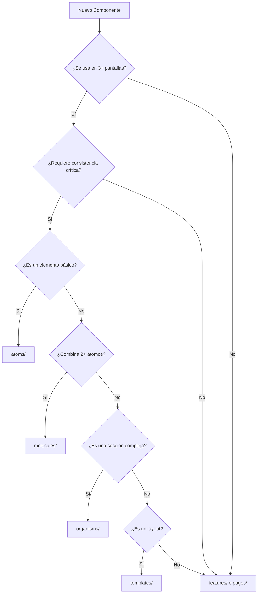

# Guía de Implementación: Atomic Design Híbrido para SICORA

## 📋 **Visión General**

Esta guía documenta la implementación práctica del **ADR-004: Estrategia Híbrida de Atomic Design** para el frontend SICORA.

**Principio clave**: Atomic Design selectivo que maximiza beneficios mientras minimiza overhead.

---

## 🎯 **Filosofía: 80/20 + Pragmatismo**

### **¿Cuándo SÍ usar Atomic Design?**

Un componente entra en la jerarquía atómica SOLO si cumple **mínimo 2 criterios**:

✅ **Reutilización Alta**: Se usa en 3+ pantallas diferentes  
✅ **Consistencia Crítica**: Variaciones causan problemas UX  
✅ **Complejidad Mobile**: Requiere optimización táctil específica  
✅ **Valor Educativo**: Demuestra conceptos importantes  
✅ **Testing Complejo**: Necesita testing aislado por estados

### **¿Cuándo NO usar Atomic Design?**

❌ **Páginas específicas** (ProfilePage, ReportsPage)  
❌ **Componentes únicos** (WelcomeModal, SpecificErrorPage)  
❌ **Wrappers simples** que solo agregan estilos  
❌ **Lógica de dominio** específica de una funcionalidad  
❌ **Prototipos rápidos** que pueden cambiar radicalmente

---

## 🧩 **Estructura de Componentes Seleccionados**

### **Átomos (4-6 componentes máximo)**

```typescript
// src/components/atoms/TouchButton/TouchButton.tsx
interface TouchButtonProps {
  variant: 'primary' | 'secondary' | 'success' | 'danger';
  size: 'touch' | 'large' | 'medium' | 'small' | 'full';
  loading?: boolean;
  disabled?: boolean;
  children: React.ReactNode;
  onClick?: () => void;
}

// src/components/atoms/TouchInput/TouchInput.tsx
interface TouchInputProps {
  label?: string;
  error?: string;
  helper?: string;
  required?: boolean;
  type?: 'text' | 'email' | 'password' | 'search';
}

// src/components/atoms/StatusBadge/StatusBadge.tsx
interface StatusBadgeProps {
  status: 'present' | 'absent' | 'late' | 'excused';
  size?: 'small' | 'medium' | 'large';
  showIcon?: boolean;
}

// src/components/atoms/LoadingSpinner/LoadingSpinner.tsx
interface LoadingSpinnerProps {
  size?: 'small' | 'medium' | 'large';
  color?: 'primary' | 'white' | 'gray';
  overlay?: boolean;
}
```

### **Moléculas (4-8 componentes máximo)**

```typescript
// src/components/molecules/LoginForm/LoginForm.tsx
interface LoginFormProps {
  onSubmit: (credentials: LoginCredentials) => Promise<void>;
  loading?: boolean;
  error?: string;
  initialValues?: Partial<LoginCredentials>;
}

// src/components/molecules/UserCard/UserCard.tsx
interface UserCardProps {
  user: User;
  variant?: 'compact' | 'detailed' | 'avatar-only';
  actions?: Array<{ label: string; onClick: () => void }>;
  selectable?: boolean;
  selected?: boolean;
}

// src/components/molecules/AttendanceRow/AttendanceRow.tsx
interface AttendanceRowProps {
  student: Student;
  attendance?: AttendanceRecord;
  onToggle?: (studentId: string, status: AttendanceStatus) => void;
  readonly?: boolean;
  compact?: boolean;
}

// src/components/molecules/SearchInput/SearchInput.tsx
interface SearchInputProps {
  placeholder?: string;
  onSearch: (query: string) => void;
  filters?: Array<{ key: string; label: string; options: string[] }>;
  debounceMs?: number;
}
```

### **Organismos (3-5 componentes máximo)**

```typescript
// src/components/organisms/MobileAttendanceList/MobileAttendanceList.tsx
interface MobileAttendanceListProps {
  students: Student[];
  onToggleAttendance: (studentId: string, status: AttendanceStatus) => void;
  loading?: boolean;
  readonly?: boolean;
  groupBy?: 'none' | 'program' | 'status';
}

// src/components/organisms/AdaptiveNavigation/AdaptiveNavigation.tsx
interface AdaptiveNavigationProps {
  user: User;
  currentPath: string;
  onNavigate: (path: string) => void;
  onLogout: () => void;
}

// src/components/organisms/DashboardHeader/DashboardHeader.tsx
interface DashboardHeaderProps {
  title: string;
  user: User;
  actions?: Array<{ label: string; onClick: () => void }>;
  breadcrumbs?: Array<{ label: string; path?: string }>;
}
```

### **Templates (3-4 layouts máximo)**

```typescript
// src/components/templates/AdaptiveLayout/AdaptiveLayout.tsx
interface AdaptiveLayoutProps {
  children: React.ReactNode;
  title: string;
  user: User;
  navigation?: boolean;
  header?: boolean;
  sidebar?: React.ReactNode;
}

// src/components/templates/AuthLayout/AuthLayout.tsx
interface AuthLayoutProps {
  children: React.ReactNode;
  title: string;
  subtitle?: string;
  backgroundImage?: string;
}

// src/components/templates/EmptyStateLayout/EmptyStateLayout.tsx
interface EmptyStateLayoutProps {
  icon: React.ReactNode;
  title: string;
  description: string;
  action?: { label: string; onClick: () => void };
}
```

---

## 📁 **Estructura de Directorios Completa**

```
src/
├── components/
│   ├── atoms/                    # Solo 4-6 componentes críticos
│   │   ├── TouchButton/
│   │   │   ├── TouchButton.tsx
│   │   │   ├── TouchButton.test.tsx
│   │   │   ├── TouchButton.stories.tsx
│   │   │   └── index.ts
│   │   ├── TouchInput/
│   │   ├── StatusBadge/
│   │   └── LoadingSpinner/
│   │
│   ├── molecules/                # Solo 4-8 combinaciones esenciales
│   │   ├── LoginForm/
│   │   ├── UserCard/
│   │   ├── AttendanceRow/
│   │   └── SearchInput/
│   │
│   ├── organisms/                # Solo 3-5 secciones complejas
│   │   ├── MobileAttendanceList/
│   │   ├── AdaptiveNavigation/
│   │   └── DashboardHeader/
│   │
│   ├── templates/                # Solo 3-4 layouts base
│   │   ├── AdaptiveLayout/
│   │   ├── AuthLayout/
│   │   └── EmptyStateLayout/
│   │
│   ├── pages/                    # Páginas específicas (estructura plana)
│   │   ├── LoginPage.tsx
│   │   ├── DashboardPage.tsx
│   │   ├── AttendancePage.tsx
│   │   ├── ProfilePage.tsx
│   │   └── ReportsPage.tsx
│   │
│   └── features/                 # Componentes específicos por funcionalidad
│       ├── attendance/
│       │   ├── AttendanceFilters.tsx
│       │   ├── AttendanceExport.tsx
│       │   └── AttendanceHistory.tsx
│       ├── reports/
│       │   ├── ReportGenerator.tsx
│       │   └── ReportChart.tsx
│       └── profile/
│           ├── ProfileForm.tsx
│           └── ProfileAvatar.tsx
│
├── hooks/                        # Custom hooks reutilizables
│   ├── useViewport.ts
│   ├── useAuth.ts
│   ├── useAttendance.ts
│   └── useLocalStorage.ts
│
├── services/                     # Clients API por backend stack
│   ├── attendanceService.ts
│   ├── authService.ts
│   └── userService.ts
│
├── utils/                        # Funciones utilitarias
│   ├── classNames.ts
│   ├── formatters.ts
│   └── validators.ts
│
├── types/                        # Definiciones TypeScript
│   ├── auth.ts
│   ├── attendance.ts
│   └── user.ts
│
└── styles/                       # CSS global y configuración
    ├── globals.css
    └── tailwind.config.js
```

---

## 🔄 **Flujo de Decisión: ¿Dónde va mi componente?**



---

## 📝 **Convenciones de Nomenclatura**

### **Átomos**

- **Patrón**: `[Prefix][Function]`
- **Ejemplos**: `TouchButton`, `StatusBadge`, `LoadingSpinner`
- **Evitar**: `Button` (muy genérico), `RedButton` (específico de estilo)

### **Moléculas**

- **Patrón**: `[Function][Type]`
- **Ejemplos**: `LoginForm`, `UserCard`, `SearchInput`
- **Evitar**: `Form` (muy genérico), `ComplexLoginFormWithValidation` (muy específico)

### **Organismos**

- **Patrón**: `[Context][Function][Type]`
- **Ejemplos**: `MobileAttendanceList`, `AdaptiveNavigation`, `DashboardHeader`
- **Evitar**: `List` (muy genérico), `Navigation` (sin contexto)

### **Templates**

- **Patrón**: `[Context]Layout`
- **Ejemplos**: `AdaptiveLayout`, `AuthLayout`, `EmptyStateLayout`
- **Evitar**: `Layout` (muy genérico), `MainPageLayout` (muy específico)

---

## 🧪 **Testing Strategy**

### **Átomos**: Unit Testing Exhaustivo

```typescript
// TouchButton.test.tsx
describe('TouchButton', () => {
  test('renders all variants correctly');
  test('handles touch interactions properly');
  test('shows loading state correctly');
  test('respects disabled state');
  test('has proper accessibility attributes');
});
```

### **Moléculas**: Integration Testing

```typescript
// LoginForm.test.tsx
describe('LoginForm', () => {
  test('submits form with valid data');
  test('shows validation errors correctly');
  test('handles loading state during submission');
  test('integrates properly with auth service');
});
```

### **Organismos**: E2E Testing

```typescript
// MobileAttendanceList.test.tsx
describe('MobileAttendanceList', () => {
  test('complete attendance flow works end-to-end');
  test('handles large datasets without performance issues');
  test('adapts properly to different screen sizes');
});
```

---

## 📊 **Métricas de Monitoreo**

### **Métricas Mensuales**

#### **Reutilización de Componentes**

```typescript
// Script para medir reutilización
const componentUsage = {
  TouchButton: { usedIn: 15, screens: 8 },
  UserCard: { usedIn: 6, screens: 4 },
  LoginForm: { usedIn: 2, screens: 2 },
  // ...
};

// Meta: >3 usos por componente en atomic design
```

#### **Velocidad de Desarrollo**

- **Tiempo promedio** para nueva pantalla
- **Líneas de código** reutilizadas vs nuevas
- **Bugs** relacionados con inconsistencias UI

#### **Satisfacción del Desarrollador**

- **Encuesta mensual**: ¿Atomic design ayuda o estorba?
- **Tiempo** debatiendo ubicación vs implementando
- **Facilidad** para nuevos desarrolladores

---

## 🚀 **Próximos Pasos**

### **Fase 1: Implementación Inicial (2-3 semanas)**

1. **Crear átomos básicos** (TouchButton, TouchInput)
2. **Configurar Storybook** para documentación
3. **Implementar primera molécula** (LoginForm)
4. **Establecer testing patterns**

### **Fase 2: Expansión Controlada (2-3 semanas)**

1. **Agregar organismos críticos** (MobileAttendanceList)
2. **Crear templates base** (AdaptiveLayout)
3. **Migrar componentes existentes** que califiquen
4. **Documentar decisiones y criterios**

### **Fase 3: Optimización (1-2 semanas)**

1. **Revisar métricas** de reutilización y satisfacción
2. **Refactorizar** componentes que no agreguen valor
3. **Documentar lessons learned**
4. **Establecer proceso** de revisión periódica

---

## ⚠️ **Alertas y Señales de Problemas**

### **🚨 Señales Rojas - Detener y Revisar**

- Debates de >30min sobre ubicación de componentes
- Componentes con <2 usos después de 1 mes
- Wrappers que solo cambian estilos CSS
- Desarrolladores creando componentes duplicados

### **🟡 Señales Amarillas - Monitorear**

- Atomic design representa >30% del tiempo de desarrollo
- Más de 10 componentes por nivel (atoms, molecules, etc.)
- Testing de componentes toma >40% del tiempo total
- Nuevos desarrolladores tardan >1 día en ubicar componentes

### **🟢 Señales Verdes - Continuar**

- Nuevas pantallas se ensamblan en <1 día
- Componentes se reutilizan sin modificaciones
- Cambios visuales se propagan automáticamente
- Desarrolladores eligen reutilizar sobre recrear

---

**Documento actualizado**: 16 de junio de 2025  
**Próxima revisión**: 30 de junio de 2025  
**Responsable**: Team Lead Frontend
