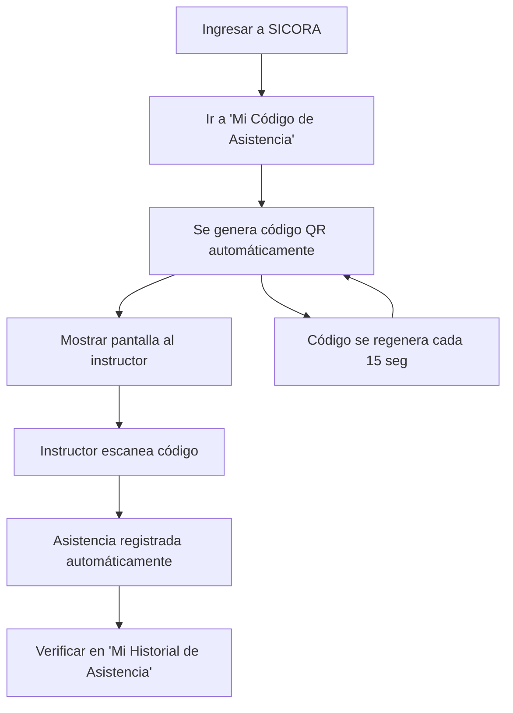
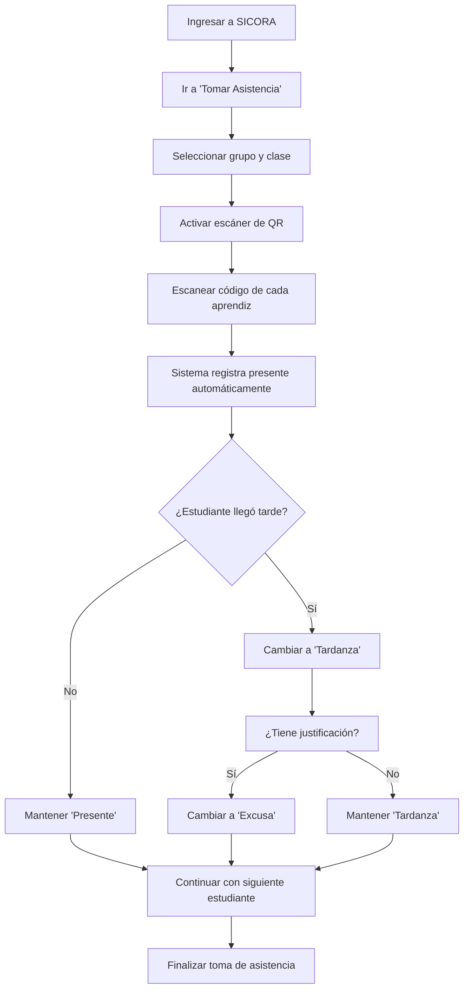

# 🔄 ACTUALIZACIÓN CRÍTICA: SISTEMA DE ASISTENCIA CON CÓDIGO QR

**Fecha de actualización:** 30 de junio de 2025  
**Impacto:** AttendanceService, Frontend, KBService, Documentación  
**Prioridad:** CRÍTICA - Implementación inmediata requerida

---

## 🎯 CAMBIOS FUNDAMENTALES EN EL SISTEMA DE ASISTENCIA

### **❌ MODELO ANTERIOR (INCORRECTO):**

- Aprendices marcaban su propia asistencia
- Autogestión de tardanzas y faltas por parte de estudiantes
- Control distribuido de asistencia

### **✅ MODELO CORRECTO (A IMPLEMENTAR):**

- **INSTRUCTORES** son los únicos con autoridad para gestionar asistencia
- **APRENDICES** solo generan códigos QR y consultan información
- **CÓDIGOS QR** se regeneran cada 15 segundos por seguridad
- Control centralizado en manos del instructor

---

## 🔧 ACTUALIZACIONES REQUERIDAS POR MICROSERVICIO

### **1. AttendanceService (Backend)**

#### **APIs a Modificar/Crear:**

**Para Aprendices:**

```http
GET /api/attendance/my-qr-code
- Genera código QR único con timestamp
- Regeneración automática cada 15 segundos
- Válido solo durante horario de clase

GET /api/attendance/my-history
- Consulta de historial personal (solo lectura)
- No permite modificaciones
```

**Para Instructores:**

```http
POST /api/attendance/scan-qr
- Recibe código QR escaneado
- Valida autenticidad y vigencia
- Registra asistencia del aprendiz

PUT /api/attendance/change-status
- Cambiar falta por tardanza
- Cambiar falta por excusa
- Requiere justificación para excusas

GET /api/attendance/group/{groupId}
- Lista de asistencia del grupo
- Funciones de gestión para instructor
```

#### **Nuevas Funcionalidades:**

- **QR Code Generator:** Algoritmo de generación segura con timestamp
- **QR Code Validator:** Verificación de autenticidad y vigencia
- **Permission System:** Control de acceso por roles
- **Automatic Regeneration:** Sistema que regenera códigos cada 15 segundos

### **2. Frontend (React Native)**

#### **Pantallas para Aprendices:**

**Pantalla: Mi Código de Asistencia**

```typescript
// Componente: AttendanceQRCode.tsx
- Genera y muestra código QR en tiempo real
- Contador visual de regeneración (15 seg)
- Instrucciones claras para mostrar al instructor
- Estado de conexión y validez del código
```

**Pantalla: Mi Historial de Asistencia**

```typescript
// Componente: AttendanceHistory.tsx
- Vista de solo lectura del historial
- Filtros por fecha, materia, estado
- Indicadores visuales de presente/tardanza/falta/excusa
- Sin opciones de modificación
```

#### **Pantallas para Instructores:**

**Pantalla: Tomar Asistencia**

```typescript
// Componente: TakeAttendance.tsx
- Selector de grupo y clase
- Escáner de códigos QR integrado
- Lista de estudiantes con estados
- Botones para cambiar estados de asistencia
```

**Pantalla: Gestión de Asistencia**

```typescript
// Componente: ManageAttendance.tsx
- Vista completa del grupo
- Funciones para cambiar falta por tardanza
- Gestión de justificaciones y excusas
- Generación de reportes
```

### **3. KBService (Documentación y Soporte)**

#### **Contenido Crítico a Actualizar:**

**FAQs para Aprendices:**

- ¿Cómo genero mi código QR de asistencia?
- ¿Por qué mi código cambia cada 15 segundos?
- ¿Qué hago si el instructor no puede escanear mi código?
- ¿Cómo consulto mi historial de asistencia?
- ¿Cómo envío justificaciones al instructor?

**FAQs para Instructores:**

- ¿Cómo tomo asistencia con códigos QR?
- ¿Cómo cambio una falta por tardanza?
- ¿Cómo gestiono excusas y justificaciones?
- ¿Qué hago si un código QR no es válido?
- ¿Cómo genero reportes de asistencia?

**Guías paso a paso:**

- Tutorial completo del sistema de códigos QR
- Procedimientos de gestión de asistencia para instructores
- Resolución de problemas comunes con códigos QR

---

## 📱 FLUJO DE TRABAJO ACTUALIZADO

### **🎓 Para Aprendices:**



### **👨‍🏫 Para Instructores:**



---

## 🔒 CONSIDERACIONES DE SEGURIDAD

### **Código QR:**

- **Generación:** Algoritmo criptográfico seguro con timestamp
- **Vigencia:** Máximo 15 segundos por código
- **Unicidad:** Cada código es único e irrepetible
- **Validación:** Verificación de timestamp y hash en el servidor

### **Control de Acceso:**

- **Aprendices:** Solo lectura de su propia información
- **Instructores:** Control total sobre grupos asignados
- **Administrativos:** Supervisión y reportes institucionales

### **Prevención de Fraudes:**

- Regeneración automática cada 15 segundos
- Validación de ubicación (opcional)
- Logs completos de todas las transacciones
- Imposibilidad de reutilizar códigos expirados

---

## 📊 MÉTRICAS Y MONITOREO

### **KPIs del Nuevo Sistema:**

- **Tiempo promedio de escaneo:** < 3 segundos por estudiante
- **Tasa de éxito de escaneo:** > 95%
- **Códigos QR generados por día:** Métrica de uso
- **Intentos de fraude detectados:** Seguridad del sistema

### **Alertas Automáticas:**

- Códigos QR que no se escanean en tiempo límite
- Intentos de escaneo de códigos expirados
- Patrones sospechosos de asistencia
- Errores de conectividad en la generación de códigos

---

## 🚀 PLAN DE IMPLEMENTACIÓN

### **Fase 1 (Semana 1): Backend**

- [ ] Desarrollar API de generación de códigos QR
- [ ] Implementar sistema de regeneración automática
- [ ] Crear APIs de gestión para instructores
- [ ] Configurar sistema de permisos por roles

### **Fase 2 (Semana 2): Frontend**

- [ ] Desarrollar pantalla de código QR para aprendices
- [ ] Crear escáner de QR para instructores
- [ ] Implementar pantallas de gestión de asistencia
- [ ] Actualizar flujos de navegación

### **Fase 3 (Semana 3): Testing y Documentación**

- [ ] Testing exhaustivo del sistema de códigos QR
- [ ] Actualizar toda la documentación de usuario
- [ ] Capacitación a instructores sobre nuevo sistema
- [ ] Migración gradual desde sistema anterior

### **Fase 4 (Semana 4): Despliegue y Monitoreo**

- [ ] Despliegue en producción
- [ ] Monitoreo de métricas de uso
- [ ] Soporte activo durante transición
- [ ] Optimizaciones basadas en feedback

---

## 📞 COMUNICACIÓN A USUARIOS

### **Mensaje para Aprendices:**

> **Importante:** A partir del [FECHA], la asistencia se registrará mediante códigos QR. Ya no necesitas "marcar asistencia" manualmente. Solo genera tu código QR y muéstralo al instructor. Tu código se actualiza automáticamente cada 15 segundos por seguridad.

### **Mensaje para Instructores:**

> **Cambio Crítico:** Ahora eres responsable de tomar la asistencia escaneando los códigos QR de tus estudiantes. Tienes control total para cambiar estados de asistencia, gestionar tardanzas y aprobar excusas. Los estudiantes ya no pueden modificar su propia asistencia.

### **Mensaje para Administrativos:**

> **Nueva Funcionalidad:** El sistema de asistencia ahora utiliza códigos QR regenerados cada 15 segundos, proporcionando mayor seguridad y control. Los instructores tienen autoridad exclusiva sobre la gestión de asistencia en sus grupos.

---

## ✅ CHECKLIST DE VERIFICACIÓN

### **Funcionalidades Críticas:**

- [ ] Códigos QR se generan correctamente
- [ ] Regeneración automática cada 15 segundos funciona
- [ ] Escáner de QR detecta códigos válidos
- [ ] Rechaza códigos expirados
- [ ] Instructores pueden cambiar estados de asistencia
- [ ] Aprendices solo tienen acceso de lectura
- [ ] Sistema de permisos funciona correctamente
- [ ] Logs de auditoría se registran

### **Documentación Actualizada:**

- [ ] FAQs del KBService actualizadas
- [ ] Guías de usuario revisadas
- [ ] Manuales técnicos modificados
- [ ] Videos tutoriales grabados
- [ ] Comunicaciones enviadas a usuarios

---

_Esta actualización es crítica para el correcto funcionamiento del sistema de asistencia y debe implementarse con la máxima prioridad._
